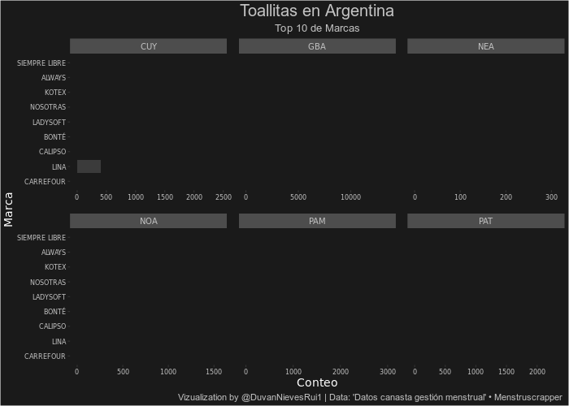
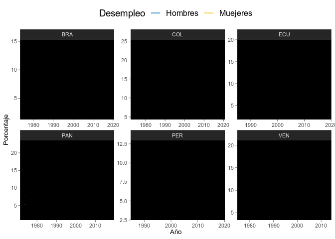

<!-- README.md is generated from README.Rmd. Please edit that file -->

```{r, include = FALSE}
knitr::opts_chunk$set(
  collapse = TRUE,
  comment = "#>"
)
```

# Datos de miercoles

<!-- badges: start -->
<!-- badges: end -->

Este repositorio contiene las participaciones de datos de miércoles

Para más información del proyecto consulta:
<a href="https://github.com/cienciadedatos/datos-de-miercoles" target="_blank">aquí</a>


## Participaciones

+------------------------------------+---------------+---------------+
| Tema                               | Fecha         | Codigo        |
+====================================+===============+===============+
| Datos empleo y géneros             | `2019-10-16`  | <a href="https://duvancho321.github.io/Datos_de_miercoles/Folder/16-10-19" target="_blank">Archivo</a>  |
+------------------------------------+---------------+---------------+
| Datos canasta gestión mestrual     | `2019-12-04`  | <a href="https://duvancho321.github.io/Datos_de_miercoles/Folder/04-11-19" target="_blank">Archivo</a>  |
+------------------------------------+---------------+---------------+
| Día de los Derechos Humanos        | `2019-12-11`  | <a href="https://duvancho321.github.io/Datos_de_miercoles/Folder/11-12-19" target="_blank">Archivo</a>  |
+------------------------------------+---------------+---------------+
|                                    |               |               |
+------------------------------------+---------------+---------------+
|                                    |               |               |
+------------------------------------+---------------+---------------+
|                                    |               |               |
+------------------------------------+---------------+---------------+

### Semana 36


### Semana 35



### Semana 28

